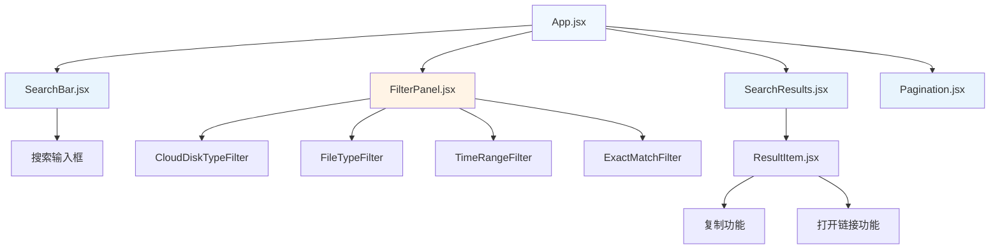

# UI重设计和筛选功能增强 - 设计文档

## Overview

本设计文档描述了97网盘资源搜索uTools插件的UI重设计和筛选功能增强的技术实现方案。主要目标是采用苹果设计风格，简化用户操作流程，并严格按照/api/search接口文档实现筛选功能，提供简洁、优雅的用户体验。

## Steering Document Alignment

### Technical Standards (tech.md)
由于项目中未发现steering文档，本设计将遵循以下技术标准：
- React函数式组件 + Hooks模式
- Vite构建工具和开发服务器
- 模块化CSS设计，遵循苹果设计系统
- uTools插件架构规范

### Project Structure (structure.md)
遵循现有项目结构约定：
- `src/components/` - React组件目录
- `src/index.css`, `src/main.css` - 样式文件
- `public/plugin.json` - uTools插件配置
- `public/preload/services.js` - 预加载服务

## Code Reuse Analysis

### Existing Components to Leverage
- **SearchBar**: 保留核心搜索功能，移除本地/联网切换按钮
- **ResourceTypeFilter**: 重构为符合API接口的文件类型筛选
- **SearchResults**: 保持现有结果展示逻辑
- **Pagination**: 复用现有分页组件

### Integration Points
- **API服务**: 严格按照`/api/search`接口文档实现筛选参数
- **状态管理**: 利用现有React状态管理模式
- **uTools集成**: 保持现有的复制和打开链接功能

## Architecture

本设计采用组件化架构，遵循苹果设计系统的简洁性和一致性原则。UI重设计将采用苹果风格的设计语言，筛选功能将严格按照API接口文档实现。

### Modular Design Principles
- **Single File Responsibility**: 每个组件文件专注于单一功能领域
- **Component Isolation**: 创建小而专注的组件，避免大型单体组件
- **Service Layer Separation**: 分离数据访问、业务逻辑和展示层
- **Utility Modularity**: 将工具函数拆分为专注的单一用途模块



## API接口严格遵循

### /api/search 接口参数
根据API文档，严格实现以下筛选参数：

```javascript
// API请求参数结构
{
  query: string,              // 搜索关键词
  page: number,              // 页码
  pageSize: number,          // 每页数量
  cloudDiskType: string,     // 网盘类型筛选
  fileType: string,          // 文件类型筛选
  timeRange: string,         // 时间范围筛选
  exactMatch: boolean        // 精确筛选
}
```

## Components and Interfaces

### SearchBar (重设计 - 苹果风格)
- **Purpose:** 提供搜索输入功能，移除本地/联网切换
- **Apple Design Elements:**
  - 圆角搜索框 (border-radius: 10px)
  - SF Pro字体系列
  - 浅灰色背景 (#F2F2F7)
  - 蓝色焦点状态 (#007AFF)
- **Interfaces:** 
  - `onSearch(query)` - 搜索回调
  - `placeholder` - 占位符文本
  - `loading` - 加载状态
- **Dependencies:** React hooks (useState, useCallback)
- **Reuses:** 保留现有搜索逻辑，移除切换按钮相关代码

### FilterPanel (重设计 - 苹果风格)
- **Purpose:** 统一管理所有筛选功能，严格按照API接口
- **Apple Design Elements:**
  - 卡片式布局 (background: #FFFFFF, border-radius: 12px)
  - 阴影效果 (box-shadow: 0 1px 3px rgba(0,0,0,0.1))
  - 分段控制器样式的筛选选项
- **Interfaces:**
  - `filters` - 当前筛选状态
  - `onFilterChange(filterType, value)` - 筛选变更回调
  - `onReset()` - 重置筛选
- **Dependencies:** 各个子筛选组件
- **Reuses:** 重构现有ResourceTypeFilter组件

### CloudDiskTypeFilter (严格按API)
- **Purpose:** 网盘类型筛选，按照API接口cloudDiskType参数
- **Apple Design Elements:**
  - 分段控制器 (UISegmentedControl风格)
  - 圆角按钮组 (border-radius: 8px)
  - 蓝色选中状态 (#007AFF)
- **API Values:** 严格按照接口文档支持的网盘类型值
- **Interfaces:**
  - `selectedType` - 已选择的网盘类型
  - `onChange(type)` - 选择变更回调
- **Dependencies:** API接口规范
- **Reuses:** 新建组件，遵循苹果设计模式

### FileTypeFilter (严格按API)
- **Purpose:** 文件类型筛选，按照API接口fileType参数
- **Apple Design Elements:**
  - 标签式选择器 (类似iOS标签)
  - 圆角标签 (border-radius: 16px)
  - 灰色未选中 (#8E8E93)，蓝色选中 (#007AFF)
- **API Values:** 严格按照接口文档支持的文件类型值
- **Interfaces:**
  - `selectedType` - 已选择的文件类型
  - `onChange(type)` - 选择变更回调
- **Dependencies:** API接口规范
- **Reuses:** 重构现有ResourceTypeFilter

### TimeRangeFilter (严格按API)
- **Purpose:** 时间范围筛选，按照API接口timeRange参数
- **Apple Design Elements:**
  - 日期选择器 (类似iOS DatePicker)
  - 圆角输入框 (border-radius: 8px)
  - 清晰的标签和间距
- **API Values:** 严格按照接口文档支持的时间范围格式
- **Interfaces:**
  - `timeRange` - 时间范围值
  - `onChange(range)` - 时间变更回调
- **Dependencies:** API接口规范
- **Reuses:** 新建组件，遵循苹果设计模式

### ExactMatchFilter (严格按API)
- **Purpose:** 精确筛选，按照API接口exactMatch参数
- **Apple Design Elements:**
  - iOS风格开关 (UISwitch)
  - 圆角切换按钮
  - 绿色开启状态 (#34C759)
- **API Values:** 布尔值，严格按照接口文档
- **Interfaces:**
  - `exactMatch` - 精确匹配状态
  - `onChange(enabled)` - 状态变更回调
- **Dependencies:** API接口规范
- **Reuses:** 新建组件，遵循苹果设计模式

## Data Models

### SearchFilters (严格按API接口)
```javascript
{
  cloudDiskType: string,     // 网盘类型 - 按API接口支持的值
  fileType: string,          // 文件类型 - 按API接口支持的值
  timeRange: string,         // 时间范围 - 按API接口格式
  exactMatch: boolean        // 精确匹配 - 布尔值
}
```

### SearchRequest (严格按API接口)
```javascript
{
  query: string,             // 搜索关键词
  page: number,             // 页码
  pageSize: number,         // 每页数量
  cloudDiskType: string,    // 网盘类型筛选
  fileType: string,         // 文件类型筛选
  timeRange: string,        // 时间范围筛选
  exactMatch: boolean       // 精确筛选
}
```

## Apple Design System Implementation

### Color Palette (苹果设计系统)
- **Primary Colors:**
  - 系统蓝色: #007AFF (按钮、链接、选中状态)
  - 系统绿色: #34C759 (成功状态、开关)
  - 系统灰色: #8E8E93 (次要文本、未选中状态)
- **Background Colors:**
  - 主背景: #F2F2F7 (iOS浅色模式背景)
  - 卡片背景: #FFFFFF (纯白色卡片)
  - 分组背景: #F2F2F7 (分组区域背景)

### Typography (苹果字体系统)
- **字体栈**: -apple-system, BlinkMacSystemFont, 'SF Pro Display', 'SF Pro Text', sans-serif
- **字体大小**:
  - 大标题: 28px (font-weight: 700)
  - 标题: 22px (font-weight: 600)
  - 正文: 17px (font-weight: 400)
  - 说明文字: 15px (font-weight: 400)

### Spacing and Layout (苹果间距系统)
- **基础间距单位**: 8px
- **组件间距**: 16px
- **内容边距**: 20px
- **卡片圆角**: 12px
- **按钮圆角**: 8px
- **输入框圆角**: 10px

### Interactive Elements (苹果交互元素)
- **按钮**:
  - 主要按钮: 蓝色背景 (#007AFF)，白色文字
  - 次要按钮: 灰色边框 (#D1D1D6)，蓝色文字
  - 圆角: 8px，高度: 44px
- **输入框**:
  - 背景: #F2F2F7
  - 边框: 1px solid #D1D1D6
  - 焦点边框: 2px solid #007AFF
  - 圆角: 10px，高度: 44px
- **分段控制器**:
  - 背景: #F2F2F7
  - 选中背景: #FFFFFF
  - 阴影: 0 1px 3px rgba(0,0,0,0.1)

## Error Handling

### Error Scenarios
1. **API请求失败**
   - **Handling:** 显示苹果风格的错误提示，提供重试选项
   - **User Impact:** 用户看到优雅的错误消息和重试按钮

2. **筛选参数无效**
   - **Handling:** 严格验证API接口参数，自动修正或提示用户
   - **User Impact:** 用户看到清晰的参数验证提示

3. **网络连接问题**
   - **Handling:** 检测网络状态，显示苹果风格的离线提示
   - **User Impact:** 用户看到优雅的网络状态提示

## Testing Strategy

### Unit Testing
- 测试各个筛选组件的状态管理
- 测试API参数构建逻辑的严格性
- 测试苹果风格UI组件的渲染和交互

### Integration Testing
- 测试筛选功能与API接口的严格对接
- 测试API调用和数据处理流程
- 测试uTools插件集成功能

### End-to-End Testing
- 测试完整的搜索和筛选用户流程
- 测试复制和打开链接功能
- 测试不同筛选组合的API调用正确性

## Performance Considerations

- **防抖搜索**: 实现搜索输入防抖，减少API调用
- **筛选缓存**: 缓存筛选选项，避免重复请求
- **懒加载**: 对复杂筛选组件实现懒加载
- **苹果风格动画**: 使用CSS transitions实现流畅的苹果风格动画效果

## Implementation Notes

### 严格API接口遵循
- 所有筛选参数必须严格按照`/api/search`接口文档实现
- 不得添加接口文档中未定义的参数
- 参数值必须符合接口文档的格式要求
- 错误处理必须考虑API接口的响应格式

### 苹果设计风格要求
- 所有UI组件必须遵循苹果设计系统
- 使用苹果官方的颜色、字体、间距规范
- 交互动画必须符合苹果的动效标准
- 保持设计的一致性和简洁性